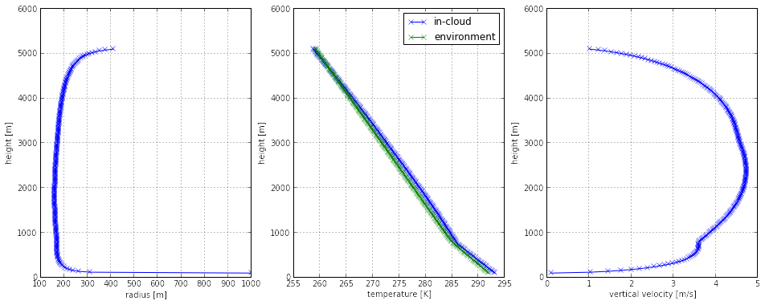

# Python 1D cloud-model

This library is being developed as a tool to implement and investigate new 1D
cloud-models, with particular emphasis on improving the cloud model in CCFM
([Convective Cloud Field Model - Nober & Graf
2005](http://www.atmos-chem-phys.net/5/2749/2005/acp-5-2749-2005.html)).

Each model is based around a set of conservation equations describing the
vertical change in in-cloud variables in a convective cloud in the mature state.
Once specified each cloud-model can then be integrated, which is done
using one of [scipy's ODE integrators](https://docs.scipy.org/doc/scipy/reference/generated/scipy.integrate.solve_ivp.html#scipy.integrate.solve_ivp)
for initial value problems. By default Runge-Kutta-Fehlberg is used due to
its adaptive error-correcting timestepping.

An example of an integrated cloud of a given radius follows below:

